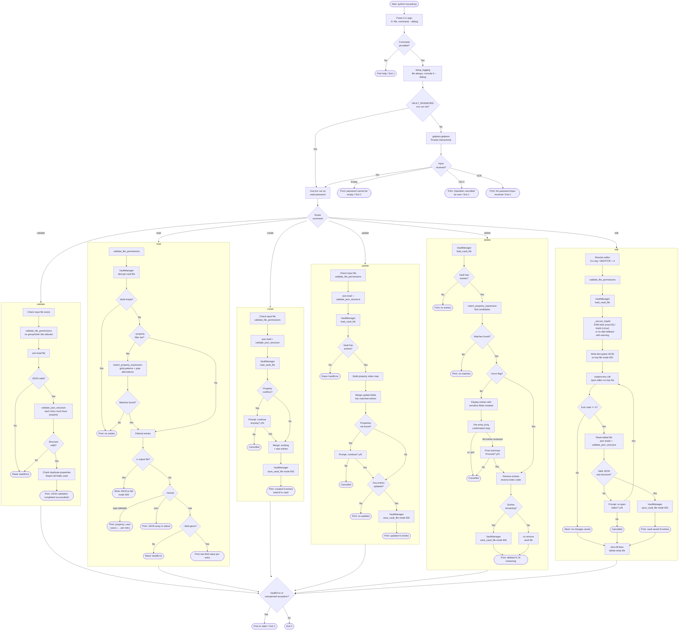

# MyVault Workflow

This diagram illustrates the complete runtime workflow of `myvault.py`, from CLI invocation through each command handler.

## Component overview

| Component | Role |
|---|---|
| `main()` | Entry point: parses args, loads password, routes to command handlers |
| `setup_logging()` | Configures file logging always; adds console handler only in `--debug` mode |
| `JSONValidator` | Validates vault file permissions (owner-only access: no group/other bits) and JSON structure (required `property` field) |
| `VaultManager` | Wraps Ansible `VaultLib` to encrypt/decrypt vault files using the provided password |
| `match_property_expression()` | Evaluates glob patterns and pipe-separated alternatives against a property value |
| `_secure_tmpdir()` | Context manager that provides a memory-backed (RAM disk / tmpfs) temp directory for edit operations |
| `handle_validate()` | Validates a plaintext JSON file structure without touching the vault |
| `handle_read()` | Decrypts the vault and outputs matching entries in pipe, JSON, or raw format |
| `handle_create()` | Merges new entries from a JSON file into the encrypted vault |
| `handle_update()` | Merges field-level updates from a JSON file into existing vault entries |
| `handle_delete()` | Removes matching entries from the vault with per-entry confirmation (or `--force`) |
| `handle_edit()` | Decrypts the vault to a secure temp file, opens an editor, validates, and re-encrypts on save |
